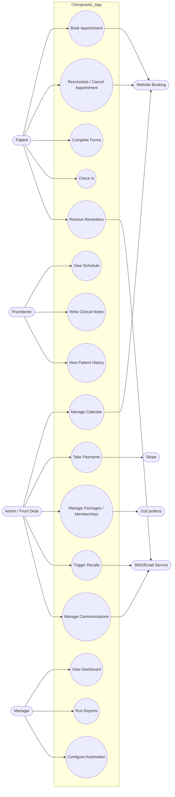

# Chiropractic App Use Cases

This document captures the updated workflow model as editable project documentation so the React prototype and the architecture stay aligned.

## Internal Roles

- Patient
- Practitioner
- Admin / Front Desk
- Manager

## External Systems

- Stripe for payment processing
- GoCardless for packages and membership plans
- Website Booking for online booking intake
- SMS/Email Service for automated communications

## Mermaid Diagram

## Coverage Notes

- Patient flow covers booking, schedule changes, digital forms, check-in, and reminders.
- Practitioner flow covers daily schedule visibility, note entry, and patient history review.
- Admin / Front Desk flow covers calendar operations, payments, memberships, recalls, and communications.
- Manager flow covers dashboard visibility, reporting, and automation control.
- External system touchpoints are explicit for payments, memberships, online booking, and communications.
